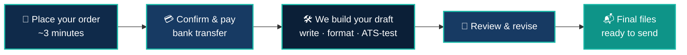
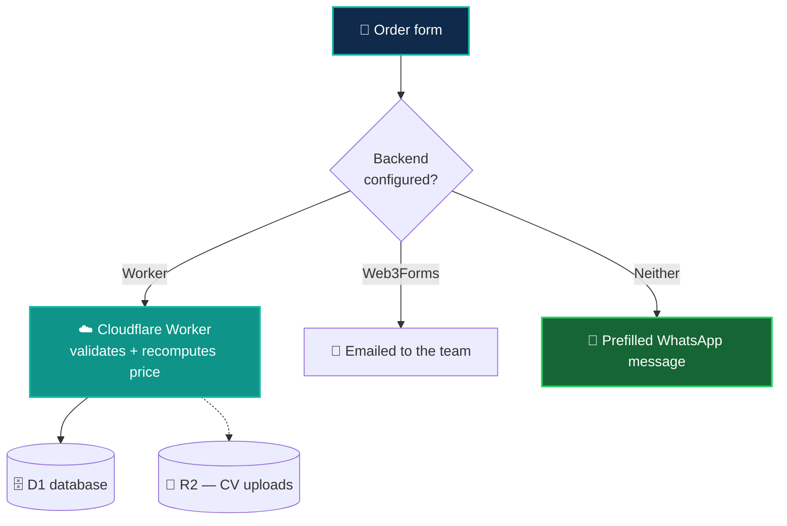

<!--
════════════════════════════════════════════════════════════════════════════════
  GETMYCV — GITHUB ORGANIZATION PROFILE README
  Repo path: github.com/GetMyCV/.github  →  profile/README.md
  Styled to match the Falcon 98 / Dev Ceylon / SecureDoc Portal profile theme.
  Brand colours: navy #0F2A4A · teal #14B8A6 (from tailwind.config.ts).
  Content mirrors GetMyCV.github.io/content/*.ts — prices live in pricing.ts.
════════════════════════════════════════════════════════════════════════════════
-->

<!-- ╔══════════════════════════ ANIMATED HEADER ══════════════════════════╗ -->

  

  <a href="https://getmycv.github.io">
    <picture>
      <source media="(prefers-color-scheme: dark)" srcset="https://raw.githubusercontent.com/GetMyCV/GetMyCV.github.io/main/public/brand/logo-white.png" />
      
    </picture>
  </a>

<h2 align="center">
  Hey there, we are GetMyCv
  
</h2>

<h3 align="center">ATS-friendly CVs, cover letters, LinkedIn makeovers &amp; portfolio websites 📄</h3>
<h4 align="center">For Sri Lankan job seekers — delivered in days, not weeks 🇱🇰</h4>

<!-- ╔════════════════════════════ TYPING LINE ════════════════════════════╗ -->

  

<!-- ╔════════════════════════════ STAT BADGES ════════════════════════════╗ -->

  
  
  
  
  

<!-- ╔══════════════════════════ QUICK LINK ROW ═══════════════════════════╗ -->

  
  
  
  
  
  

  

<!-- ╔═══════════════════════════════ ABOUT ═══════════════════════════════╗ -->
##  &nbsp;About GetMyCv

**GetMyCv** writes the documents that get you the interview. Most large employers screen CVs with software before a human ever sees them, and the human who does look spends about seven seconds. We write for both readers.

- ✍️ &nbsp;Every CV is **written from scratch** around your target role — not a template fill-in
- 🤖 &nbsp;Formatted to be **ATS-friendly** and tested against a real applicant-tracking parser before delivery
- 📊 &nbsp;Achievements phrased **with numbers**, so your impact is obvious at a glance
- 🌐 &nbsp;Portfolio sites hosted **free on GitHub Pages under your own account** — you own it, forever
- 🇱🇰 &nbsp;Built for **Sri Lankan job seekers**, priced in LKR, paid by bank transfer

<a href="#readme">▲ back to top</a>

<!-- ╔══════════════════════════════ SERVICES ═════════════════════════════╗ -->
##  &nbsp;What We Do

  
  
  
  
  

<table>
<tr>
<td width="50%" valign="top">

#### 📄 &nbsp;CV Writing
*A recruiter spends about seven seconds on your CV. We make those seconds count.*
- Written from scratch around your target role
- Achievements phrased with numbers
- Polished PDF **plus** an editable Word file you keep forever

#### 🔍 &nbsp;ATS-Friendly Formatting
*Most large employers screen CVs with software first.*
- Simple, parseable structure — no tables, text boxes or graphics
- Keywords matched to the adverts you're actually applying to
- Tested against a real ATS parser before delivery

#### ✉️ &nbsp;Cover Letter
*A short, specific letter that sounds like you on your best day.*
- Tailored to one target role, reusable for the rest
- Answers: why you, why them, why now

</td>
<td width="50%" valign="top">

#### 🌐 &nbsp;Personal Portfolio Website
*One link that shows your work, loading fast on any phone.*
- Mobile-first single page: projects, skills, contact
- Hosted on GitHub Pages under **your** account — costs nothing to run
- Custom subdomain setup, plus a guide to update it yourself

#### 💼 &nbsp;LinkedIn Profile Makeover
*Recruiters search LinkedIn first. We make sure they find you — and stay.*
- Headline and About rewritten to read like a person
- Experience aligned with your new CV
- Skills and keyword strategy for recruiter searches

</td>
</tr>
</table>

<a href="#readme">▲ back to top</a>

<!-- ╔══════════════════════════════ PRICING ══════════════════════════════╗ -->
##  &nbsp;Packages

<table>
<tr>
<th width="33%">🥉 &nbsp;Starter</th>
<th width="34%">🥈 &nbsp;Professional &nbsp;</th>
<th width="33%">🥇 &nbsp;Premium</th>
</tr>
<tr align="center">
<td><h3>LKR 4,500</h3>⏱️ 3 days</td>
<td><h3>LKR 8,500</h3>⏱️ 5 days</td>
<td><h3>LKR 17,500</h3>⏱️ 7–10 days</td>
</tr>
<tr valign="top">
<td>

*A clean, ATS-friendly CV that gets past the filters.*

- ✅ ATS-friendly CV
- ✅ PDF + editable Word file
- ✅ Keyword tuning for your role
- ✅ 1 round of revisions

</td>
<td>

*Plus the extras recruiters actually read.*

- ✅ Everything in Starter
- ✅ Tailored cover letter
- ✅ LinkedIn profile makeover
- ✅ 2 rounds of revisions

</td>
<td>

*Your own portfolio website, live on the internet.*

- ✅ Everything in Professional
- ✅ Portfolio site on GitHub Pages
- ✅ Custom subdomain setup
- ✅ 3 rounds of revisions

</td>
</tr>
</table>

<b>&nbsp;➕ &nbsp;Add-ons</b>

 

| Add-on | Price | What you get |
|:--|--:|:--|
| ⚡ **Express delivery** | LKR 3,000 | Front of the queue — ships in 48 hours |
| 🔗 **Custom domain setup** | LKR 2,500 | Your own domain (e.g. `yourname.lk`) pointed at your portfolio. Domain fee not included |
| 🔁 **Extra revision round** | LKR 1,500 | One more round of edits after your included revisions |
| 🛠️ **Portfolio maintenance (1 year)** | LKR 6,000 | Content updates and fixes for twelve months |

  

<a href="#readme">▲ back to top</a>

<!-- ╔════════════════════════════ HOW IT WORKS ═══════════════════════════╗ -->
##  &nbsp;How It Works

<table>
<tr>
<td align="center" width="25%"><h3>1️⃣</h3><b>Place your order</b> Pick a package, tell us your target role, upload your old CV if you have one.</td>
<td align="center" width="25%"><h3>2️⃣</h3><b>Confirm &amp; pay</b> Get a reference number instantly. Transfer, then send the slip on WhatsApp.</td>
<td align="center" width="25%"><h3>3️⃣</h3><b>We build your draft</b> We write, format and test your CV — and build your portfolio if included.</td>
<td align="center" width="25%"><h3>4️⃣</h3><b>Review &amp; receive</b> You review, we revise. Final files land in your inbox.</td>
</tr>
</table>

<a href="#readme">▲ back to top</a>

  

<!-- ╔═══════════════════════════ REPOSITORIES ════════════════════════════╗ -->
##  &nbsp;Inside the Organization

<table>
<tr>
<th align="left">Repository</th>
<th align="left">What it is</th>
<th align="left">Status</th>
</tr>
<tr>
<td><a href="https://github.com/GetMyCV/GetMyCV.github.io"><b>GetMyCV.github.io</b></a></td>
<td>The website — services, pricing and a three-minute order form. Plus the Cloudflare Worker that validates orders and re-checks prices server-side.</td>
<td>
   
  
</td>
</tr>
<tr>
<td><a href="https://github.com/GetMyCV/.github"><b>.github</b></a></td>
<td>This organization profile and shared community files.</td>
<td></td>
</tr>
</table>

<a href="#readme">▲ back to top</a>

<!-- ╔════════════════════════════ TECH STACK ═════════════════════════════╗ -->
##  &nbsp;Built With

  

  Next.js 15 static export · TypeScript · Tailwind CSS · React Hook Form + Zod · Cloudflare Workers + D1 + R2 · GitHub Pages

<b>&nbsp;🧩 &nbsp;How an order reaches us</b>

 

The site is pure static files on GitHub Pages, so orders are submitted from the browser to whichever backend is configured — and it always degrades rather than breaks.

The Worker recomputes every total server-side, so a tampered browser can never set its own price.

<a href="#readme">▲ back to top</a>

<!-- ╔════════════════════════════════ FAQ ════════════════════════════════╗ -->
##  &nbsp;Quick Answers

<b>&nbsp;⏱️ &nbsp;How long does it take?</b>

 
3 days for Starter, 5 for Professional, 7–10 for Premium. Need it sooner? <b>Express delivery</b> ships in 48 hours.

<b>&nbsp;🤖 &nbsp;What does "ATS-friendly" actually mean?</b>

 
Applicant tracking systems read your CV before a person does. A simple, parseable layout — no tables, text boxes or graphics — plus keywords from the job advert means the software reads it correctly and ranks it properly.

<b>&nbsp;💳 &nbsp;How do I pay?</b>

 
By bank transfer. You get an order reference straight away; send us the payment slip on WhatsApp and we start.

<b>&nbsp;🌐 &nbsp;Who owns the portfolio website?</b>

 
You do. It's hosted on GitHub Pages under your own account, so it keeps running for free and you can update it whenever you like.

  <a href="https://getmycv.github.io/#faq">More answers on the website →</a>

<a href="#readme">▲ back to top</a>

<!-- ╔═══════════════════════════════ CTA ═════════════════════════════════╗ -->
 

### Ready for your next interview?

&nbsp;

  

<b>GetMyCv</b> · Made with 💙 in Sri Lanka · <a href="mailto:hello@getmycv.lk">hello@getmycv.lk</a>

<!-- ╔═════════════════════════ ANIMATED FOOTER ═══════════════════════════╗ -->

